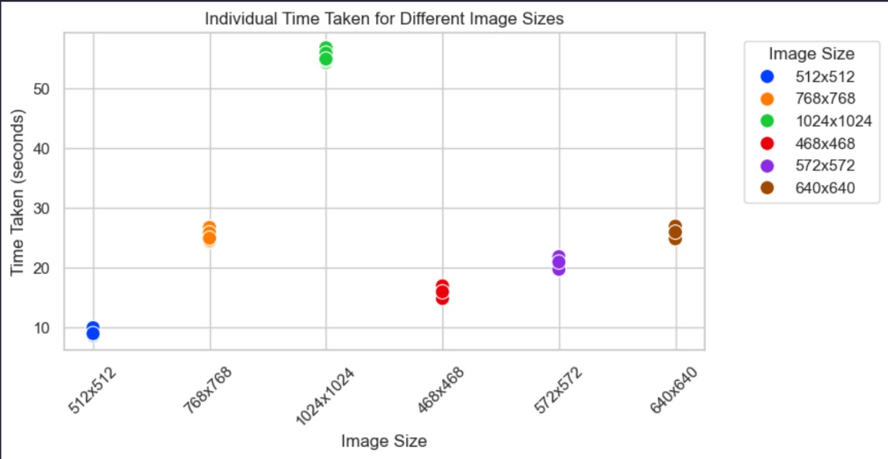

 # Text to Image Generator
A **Streamlit-based frontend** paired with a **gRPC backend** for generating images using **Realistic Vision** models. This tool supports text-to-image generation, image-to-image transformations, and freehand drawing-based inputs with stylized output options.
---
## Setup
### Prerequisites
For **local development**:
- Python 3.9+
- PyTorch with CUDA support
- NVIDIA GPU (minimum 6GB VRAM)
For **Docker deployment**:
- Docker & Docker Compose
- NVIDIA Container Toolkit (for GPU passthrough)
### Local Setup (Manual)
#### Install gRPC Tools
```bash
# Install grpcio and grpcio-tools
pip install grpcio grpcio-tools
# Compile the protobuf definitions (if not already compiled)
python -m grpc_tools.protoc -I=include --python_out=include --grpc_python_out=include include/text2image.proto
```
```bash
# Clone the repository
git clone https://github.com/your/repo.git
cd your-repo
# Create virtual environment and activate it
python -m venv venv
source venv/bin/activate        # Windows: venv\Scripts\activate
# Install dependencies
pip install -r requirements.txt
# Start the gRPC server
python include/grpc_server.py
# In a new terminal, launch the Streamlit frontend
streamlit run app.py
```
Access the app at: [http://localhost:8501](http://localhost:8501)
### Docker Setup
```bash
# Install NVIDIA Container Toolkit if not already installed
distribution=$(. /etc/os-release;echo $ID$VERSION_ID)
curl -s -L https://nvidia.github.io/nvidia-docker/gpgkey | sudo apt-key add -
curl -s -L https://nvidia.github.io/nvidia-docker/$distribution/nvidia-docker.list | sudo tee /etc/apt/sources.list.d/nvidia-docker.list
sudo apt-get update && sudo apt-get install -y nvidia-container-toolkit
sudo systemctl restart docker
# Clone and run the application
git clone https://github.com/your/repo.git
cd your-repo
docker-compose up -d
docker build -t text2image # Build command
docker run -p 8501:8501 -p 50051:50051 myapp # Run docker
```
---
## Usage
1. Enter a text prompt or draw a sketch.
2. Choose a style (realistic, anime, digital art, etc.).
3. Click **Generate**.
4. View, download, or iterate on generated images.
All images are stored in the `images/` directory.
---
## Architecture
```
.
├── app.py                # Streamlit frontend
├── Dockerfile            # Docker image definition
├── docker-compose.yml    # Service orchestration
├── images/               # Output storage
├── include/
│   ├── grpc_server.py    # Backend with Realistic vision inference
│   ├── text2image_pb2.py # Protobuf-generated classes
│   └── text2image.proto  # gRPC definitions
├── requirements.txt      # Dependencies
└── README.md             # Project documentation
```
### System Flow
1. **Frontend (Streamlit)** collects user input.
2. **gRPC Client** sends requests to the backend.
3. **Backend (Python server)** uses Realistic vision to generate images.
4. The response is returned to the frontend for display.
---
## Model Sources
This application uses:
- **Realistic Vision** model for high-fidelity image generation
- Available on [Hugging Face](https://huggingface.co/SG161222/Realistic_Vision_V5.1)
  
To use a different model, you can modify the inference logic in `grpc_server.py`.
---

## Graphs



## Limitations
- Requires a **GPU with at least 6GB VRAM** for smooth operation.
- Performance may vary depending on:
  - Prompt complexity
  - Image resolution
  - GPU power
- Generated content may occasionally be inconsistent or abstract.
- No safety filtering on prompts; inappropriate prompts may produce NSFW results unless explicitly restricted.
---
## Configuration
You can adjust the following in `docker-compose.yml`:
```yaml
environment:
  - CUDA_VISIBLE_DEVICES=0
  - GRPC_SERVER_ADDRESS=grpc-server
```
---
## Future Recommendations for Improvements
### Performance Enhancements
- Implement batch processing for multiple image generation
- Add model quantization options for lower-memory devices
- Create a queue system for handling concurrent requests

### Feature Additions
- Integration with additional stable diffusion models
- Implementation of image upscaling with ESRGAN

### User Experience
- Advanced prompt engineering interface
- Preset style templates for common use cases
- Progressive image loading during generation
---
